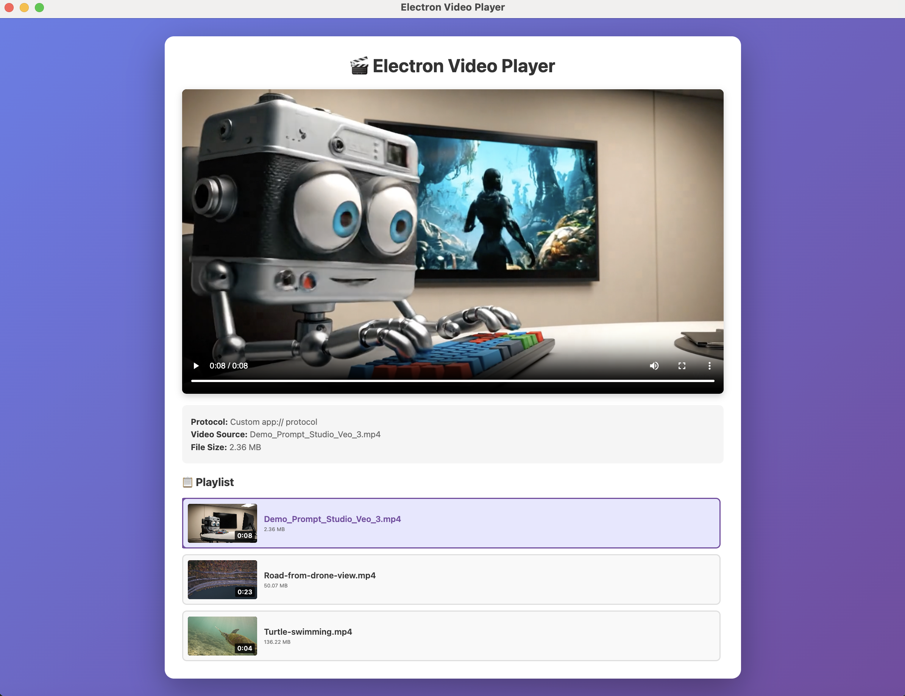

# Electron Video Player

A modern Electron application that automatically detects and plays local video files with a YouTube-style playlist interface.



## Features

- 🎬 **Automatic Video Detection** - Scans the `video/` folder and detects all video files
- 🔍 **Video Validation** - Verifies files are real videos using magic byte detection
- 📋 **YouTube-Style Playlist** - Beautiful playlist with thumbnails and duration display
- 🖼️ **Auto-Generated Thumbnails** - Creates preview thumbnails from actual video frames
- 🎯 **Click to Play** - Easy navigation between videos
- 🔒 **Secure Implementation** - Context isolation and CSP compliance
- 🎨 **Modern UI** - Gradient background, smooth animations, and hover effects
- 📺 **Custom Protocol** - Uses `app://` protocol for secure video streaming

## Supported Video Formats

- MP4 (.mp4, .m4v)
- WebM (.webm)
- OGG (.ogg)
- MOV (.mov)
- AVI (.avi)
- MKV (.mkv)

## Installation

```bash
npm install
```

## Usage

1. Place your video files in the `video/` folder
2. Run the application:

```bash
npm start
```

The app will automatically detect all video files and display them in a playlist with thumbnails.

## Architecture

### Custom Protocol Handler
The app uses a custom `app://` protocol registered as privileged with streaming support:

- **Protocol**: `app://video/`
- **Privileges**: standard, secure, supportFetchAPI, stream, bypassCSP
- **Video Folder**: `./video/`
- **Dynamic Loading**: Videos are served dynamically from the video folder

### Files

- `main.js` - Main process with protocol handler and IPC handlers
- `index.html` - Renderer process with video player UI
- `renderer.js` - Playlist logic, thumbnail generation, and video controls
- `preload.js` - Secure IPC bridge using contextBridge
- `package.json` - Dependencies and scripts

### IPC Communication

The app uses Electron's IPC for secure communication:
- **`get-video-files`** - Returns list of validated video files with metadata

### Video Validation

Files are validated through multiple checks:
1. **Extension check** - Must have a valid video extension
2. **File size check** - Must be greater than 0 bytes
3. **Magic byte verification** - Reads file headers to confirm video format
4. **Security check** - Prevents directory traversal attacks

## Technical Details

The implementation follows Electron's official documentation and best practices:
- Uses `protocol.registerSchemesAsPrivileged()` before app ready
- Uses `protocol.handle()` with `net.fetch()` for serving files
- Uses `contextBridge` for secure IPC exposure
- Includes security checks to prevent directory traversal
- Enables streaming with `stream: true` privilege for video/audio
- CSP compliant (no inline scripts)
- Auto-generates thumbnails using HTML5 video API

## UI Features

### Playlist
- Horizontal layout with thumbnail + details
- Video duration overlay on thumbnails
- File size display
- Active video highlighting
- Smooth hover animations
- Custom styled scrollbar
- Responsive design

### Video Player
- Full HTML5 video controls
- Auto-play on selection
- Metadata display (name, size, source)
- Error handling and logging

## Video Source

Videos are accessed via the custom protocol:
```
app://video/[filename]
```

Example: `app://video/Demo_Prompt_Studio_Veo_3.mp4`

This custom protocol maps to the `./video/` folder while maintaining security and enabling proper video streaming.
